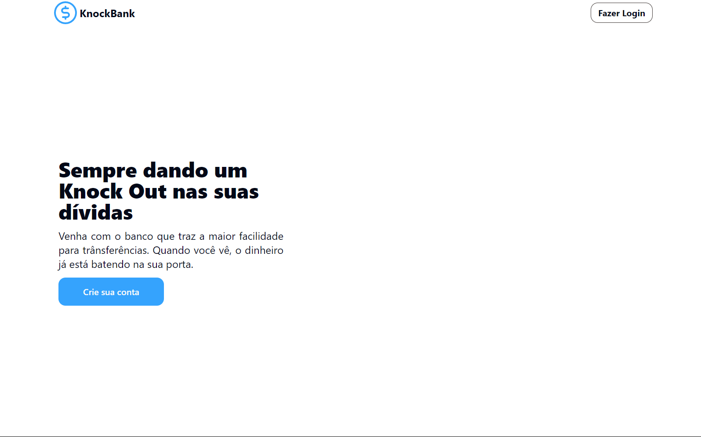
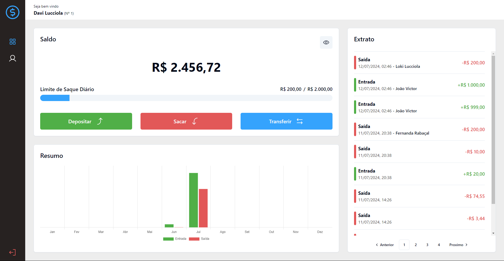
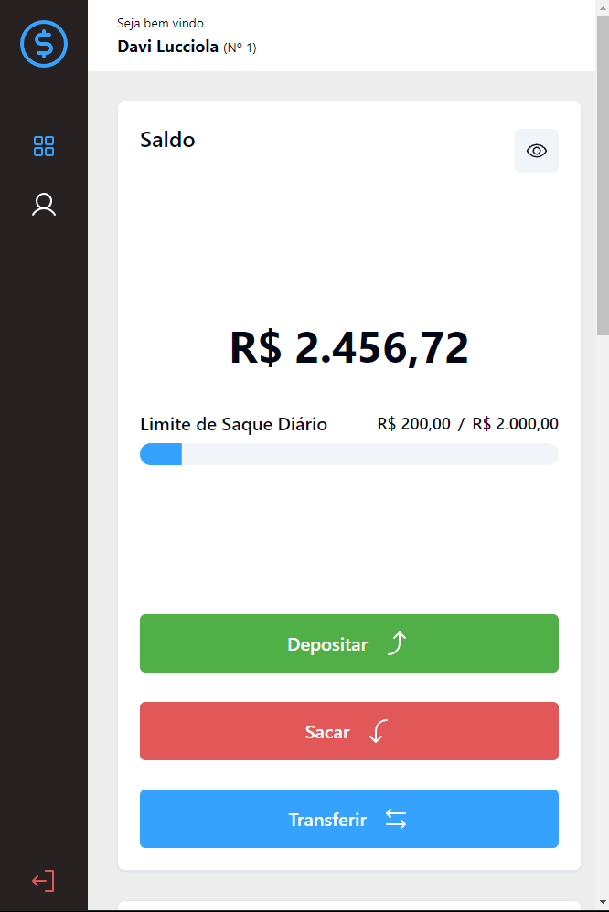
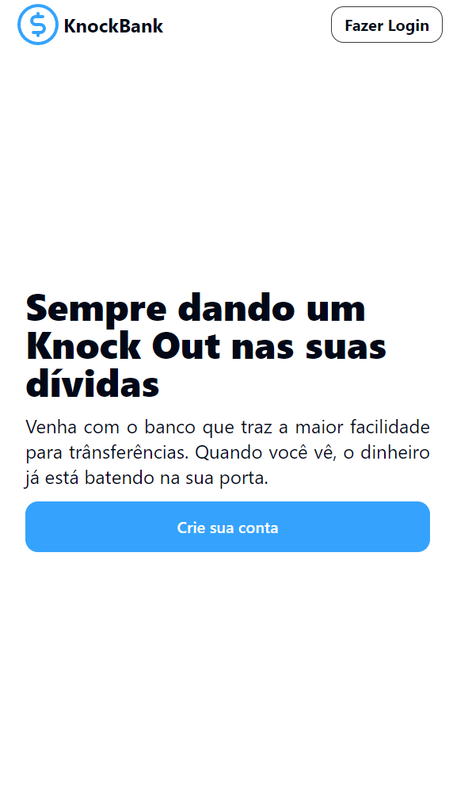

# Knock Bank

O KnockBank é uma plataforma bancaria que possibilita que os seus usuários realizem transações de deposito, saque e trânsferência para outras contas na plataforma, também disponibilizando um grafico de vizualização de entradas e saidas totais por mês do ano corrente.

Projeto Realizado inspirado em um teste técnico para Desenvolvedor Full Stack Pleno (Flask + React)

## Design

O prototipo inicial foi feito pelo [Not39](https://github.com/NOT39) em um projeto que ele chegou a prototipar para a gente implementar, mas nunca de fato realizamos, então peguei o modelo e adptei a ui para essa aplicação.

Veja aqui no [Figma](https://www.figma.com/design/1toXDiygpjzpXCa8f6FBWY/KnockBank)

O Design foi feito para ser implementando de forma responsiva, atendendo dispositivos desktop e mobile.

### Desktop

### Mobile

## System Design

WORK IN PROGRESS
(com pipelines de testes, build e deploy...)

## Tecnologias

### Frontend

### Backend (API)

#### Arquitetura

A API foi construida utilizando a arquitetura MVC com camada de Servico (MVC+Service) e foram utilizadas as seguintes abordagens durante sua construção:

- Injeção de Depêndencias, para melhor isolamento das camadas e facilitação de testes unitários
- Repository Pattern para encapsular lógica de acesso ao banco de dados e garantir atomicidade quando mais de uma entidade está sendo alterada.
- Builder Pattern, para montar objetos paginados e converter as entidades para JSON.
- Service encapsulando as regras de negócio, que através da injeção de dependencia dos repositories facilita os testes unitários.

WORK IN PROGRESS...
